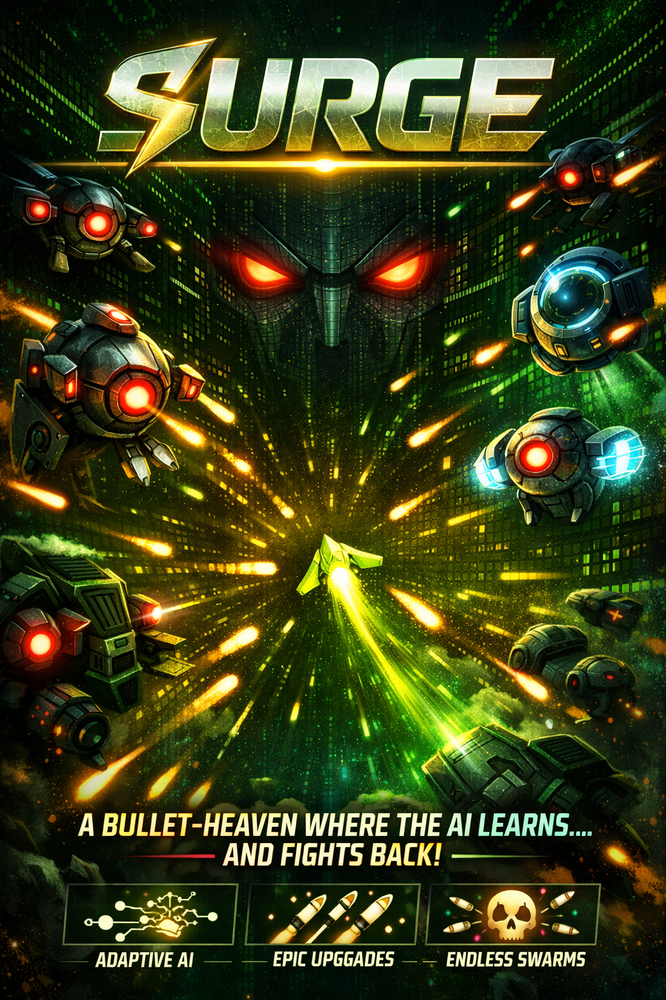

# ⚡ SURGE

**A bullet-heaven where the AI learns how you playn, and fights back.**

---

# ⚡ SURGE — AI-Driven Adaptive Bullet-Heaven Game

**A real-time adaptive bullet-heaven game where AI models player behavior and dynamically adjusts gameplay difficulty and encounters.**

SURGE is a mobile-first survival game inspired by Vampire Survivors and Swarm (League of Legends). It introduces an AI Director that continuously observes player behavior and adapts the game in real time, creating a personalized gameplay experience.

---

## 🧠 Overview

SURGE is not a static difficulty game. It uses a closed-loop AI system that:

- Observes player behavior in real time  
- Builds a dynamic model of player stress and performance  
- Adapts enemy waves, pacing, and difficulty dynamically  
- Optionally uses LLMs for higher-level decision-making and narrative generation  

The result is a game that continuously adjusts itself based on how the player is performing.

---

## 🤝 Collaboration

This project was developed in collaboration with Ayoub Chamakhi for the Mistral AI Hackathon.

My main contributions include:

- Design and implementation of the AI Director system  
- Real-time player modeling and stress detection system  
- Adaptive difficulty system using bandit-based decision logic  
- Integration of LLM-based gameplay adaptation  
- Architecture design of real-time AI feedback loops  

---

## 🧠 AI Director System

The AI Director is the core system that controls gameplay adaptation.

It works as a continuous feedback loop:

1. Collects gameplay telemetry (movement, HP, damage, dodge patterns)  
2. Computes a real-time stress score representing player state  
3. Selects enemy encounters based on player performance  
4. Dynamically adjusts difficulty and pacing  

### Core Components

- **Stress Model**: Converts gameplay signals into a continuous difficulty indicator  
- **Adaptive Engine**: Uses bandit-based logic to balance challenge and engagement  
- **LLM Director (optional)**: Generates encounter strategies and narrative descriptions  

---

## 🎮 Game Concept

- Auto-fire bullet-heaven survival gameplay  
- Wave-based enemy progression  
- Upgrade-based player builds  
- Real-time adaptive difficulty scaling  
- AI-driven encounter generation  

---

## ⚙️ Architecture

- Custom Entity Component System (ECS)  
- Fixed timestep game loop (60Hz)  
- Spatial hashing for collision detection  
- Event-driven system architecture  
- Modular AI Director system  

---

## 🧩 Enemy Types

- Drifter: Homing movement  
- Dasher: Charge attacks  
- Sprayer: Bullet patterns  
- Orbitor: Orbiting behavior  
- Splitter: Splits on death  
- Shielder: Defensive aura support  

Each enemy can appear as Elite or Boss variants.

---

## 🔧 Technology Stack

- JavaScript (ES2022)  
- HTML5 Canvas 2D  
- Custom ECS engine  
- Web Audio API (procedural sound)  
- LLM APIs (OpenAI-compatible)  
- No external game engine or dependencies  

---

## 🚀 LLM Integration

Supports multiple providers:

- OpenAI  
- Mistral AI  
- Groq  
- Together AI  
- Local models (Ollama, LM Studio, vLLM)  

The LLM can:
- Influence encounter selection  
- Generate gameplay narratives  
- Assist in adaptive difficulty decisions  

---

## 🎯 Key Features

- Real-time adaptive difficulty system  
- Player behavior modeling (stress-based system)  
- AI-driven encounter generation  
- Optional LLM-powered game director  
- Custom game engine (no dependencies)  
- Mobile-first design  
- Procedural audio system  
- Offline-capable PWA  

---

## 📊 What This Project Demonstrates

- Real-time AI system design  
- Player behavior modeling  
- Adaptive decision systems (bandit logic)  
- Applied LLM integration in interactive systems  
- Game AI architecture  
- Performance-constrained system design  

---

## ⚡ Controls

| Action | Input |
|--------|------|
| Move | WASD / Arrows / Touch |
| Dash | Space / Double tap |
| Pause | Escape |
| Fire | Automatic |

---

## ❤️ Credits

Built by Ayoub Chamakhi and Ghassen Chouikh
